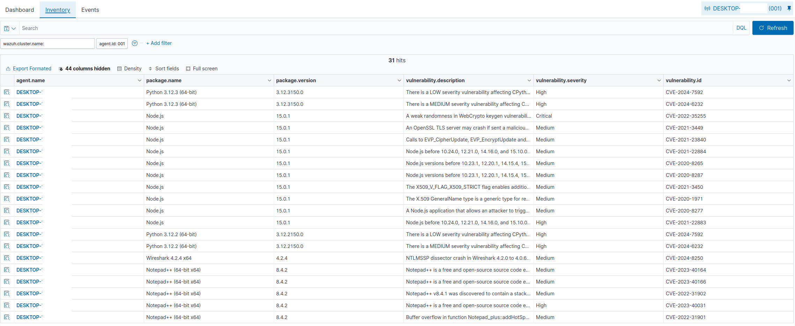

# Windows 10 PC Vulnerability Patching October 2024

Since Wazuh had an revamp in its vulnerability section since I last did this in March, I was surprised to see different vulnerable programs that weren't picked up before and also containing CVEs dating back to 2005.

Below is a table showing the differences between the scan in October and the scan I did back in March:

| Vulnerability Severity | March 2024 | October 2024 |
| ---------------------- | ---------- | ------------ |
| Critical               | 5          | 1            |
| High                   | 38         | 12           |
| Medium                 | 17         | 18           |
| -----                  | -----      | -----        |
| Total                  | 60         | 31           |

Here is also what the new vulnerability detection dashboard looks like:

In the inventory tab, I can see more detailed explanations of the vulnerable applications and more detail about what CVEs are associated with them.

This time, I won't go into much detail about remediation, but I will still document my changes. If you are interested in the difficulty I had before, here is a link to the previous scan and processes I did back in March: [Vulnerability Patching March 2024](<../March2024/Personal Windows 10 Machine/PersonalWindows10.md>).

### Vulnerable Application Remediation Steps:

1. Adobe Flash Player: Uninstalled application since Adobe Flash Player went EOL on December 31, 2020, with no further updates.

2. Notepad++: Updated application from 8.4.2 to 8.7.
3. Python 3.12.2 & 3.12.3: Uninstalled previous versions and installed Python 3.12.7.

4. Wireshark: Updated application from 4.2.4 to 4.4.0.

5. Node.js: Uninstalled Node.js 15.0.1 and installed 22.9.0.

### Lessons Learned & Conclusions

- I need to be more proactive in uninstalling unused and EOL applications like Adobe Flash Player.
- I need to pay more attention to Python updates since Python was vulnerable in both the scan this time and back in March.

### Relevant Links:

- [Vulnerability Patching March 2024](<../March2024/Personal Windows 10 Machine/PersonalWindows10.md>)
- [Main Project Page](../../README.md)
